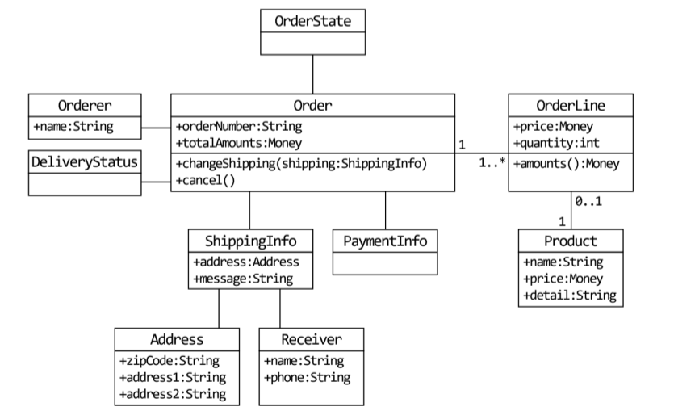

## 요구사항이 중요하다.
- 요구사항을 올바르게 이해하고 개발해야 한다. 올바르게 이해하지 못한다면 엉뚱한 기능을 만들게 된다.
- 잘못 만들어진 코드를 고치려면 많은 비용이 든다.
- 요구사항을 올바르게 이해하기 위해서는 도메인 전문가와 많은 대화를 해야 한다.

## 주문 도메인을 만들 때 필요한 객체

```
OrderState
```

```
Order
+orderNumber:String
+totalAmount:Monkey
+changeShipping(shipping:ShippingInfo)
+cancel()
```

```
Orderer
+name:String
```

```
DeliveryStatus
```

```
OrderLine
+price:Money
+quantity:int
+amounts():Money
```

```
ShippingInfo
+address:Address
+message:String
```

```
Address
+zipCode:String
+address1:String
+address2:String
```

```
Receiver
+name:String
+phone:String
```

```
PaymentInfo
```

```
Product
+name:String
+price:Money
+detail:String
```

## 상태 다이어그램


