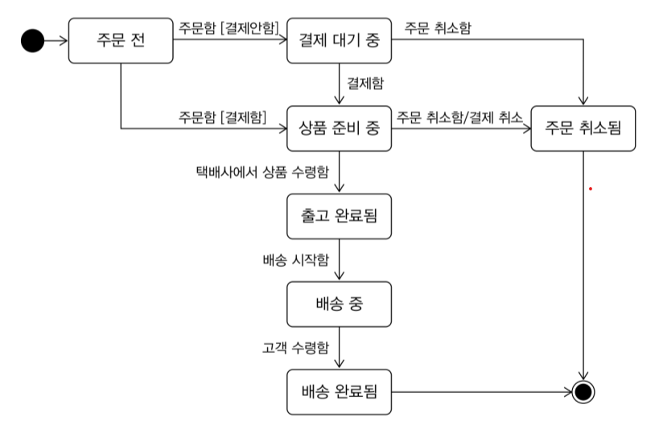

## 요구사항이 중요하다.
- 요구사항을 올바르게 이해하고 개발해야 한다. 올바르게 이해하지 못한다면 엉뚱한 기능을 만들게 된다.
- 잘못 만들어진 코드를 고치려면 많은 비용이 든다.
- 요구사항을 올바르게 이해하기 위해서는 도메인 전문가와 많은 대화를 해야 한다.

## 주문 도메인을 만들 때 필요한 객체

```
OrderState
```

```
Order
+orderNumber:String
+totalAmount:Money
+changeShipping(shipping:ShippingInfo)
+cancel()
```
- 주문 단우에 대한 클래스이다.
- 주문이란? 사용자가 선택하여 지불 단위로 설정할 상품 묶음이다.
- 주문 번호와 총 금액에 대한 정보를 얻을 수 있다.
- 주문 취소 기능을 가지고 있다.

```
Orderer
+name:String
```
- 주문자
- 주문자에 대한 배송지, 이름, 전화번호 등등 사용자에 대한 많은 정보가 있겠지만 여기서는 간단히 하기 위해 이름만 뽑도록 인터페이스를 지정하였다.
- 한 사람의 주문자는 여러 주문을 가지고 있다.

```
DeliveryStatus
```
- 주문 상태 : 결제를 했는지 배송은 하고 있는지 배송은 완료되었는지 등의 상태를 나타내기 위한 클래스

```
OrderLine
+price:Money
+quantity:int
+amounts():Money
```
- 주문라인
- 상태에 따라서 판단되는 돈, 수량, 총 금액
- 하나의 주문에 대한 여러 상태의 주문 라인이 존재할 수 있다.


```
ShippingInfo
+address:Address
+message:String
```
- 주문 정보
- 주문에 대한 주소 및 주문 메시지로
- 주문과 1:1의 관계를 가지고 있다.

```
Address
+zipCode:String
+address1:String
+address2:String
```
- 주소
- zip코드, 대략주소, 상세주소로 구성되어 있다.
- ShippingInfo와 1:1의 관계를 가지고 있다.

```
Receiver
+name:String
+phone:String
```
- 주문자와 배송대상은 다를 수 있다.

```
PaymentInfo
```

```
Product
+name:String
+price:Money
+detail:String
```
- 상품 


## 상태 다이어그램



